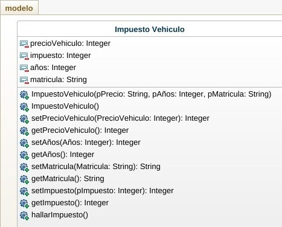

# Caso Impuesto Carro

Hacer un programa que permita calcular el impuesto de un vehiculo dependiendo de las siguientes caracteristicas
Modelo: 
a) Carro Nuevo 10% del precio del vehiculo
b) Carro usado con hasta 5 años 7% del precio del vehiculo
c) Carro usado por mas de 5 años 3% del precio del vehiculo

Si el carro esta matriculado en socorro se le descuenta el 40% del impuesto

El programa debe tener: Constructores, metodos get y set, metodos funcionales, clase ejecutable para hacer pruebas.

Analisis, Diseño, Construcción

# Analisis

Necesitaremos tres variables de tipo entero, las cuales son: Precio,Años y Impuesto y una variable de tipo String que sera la matrícula.

La variable impuesto dependera de la cantidad de años y lugar que tenga el carro.

## Diagrama de clases

